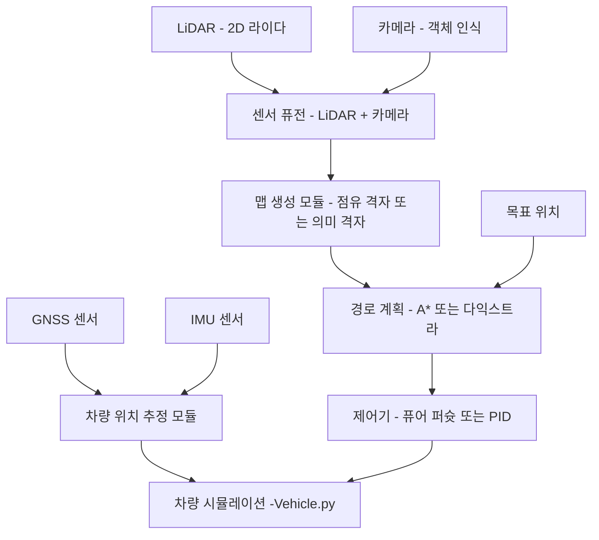
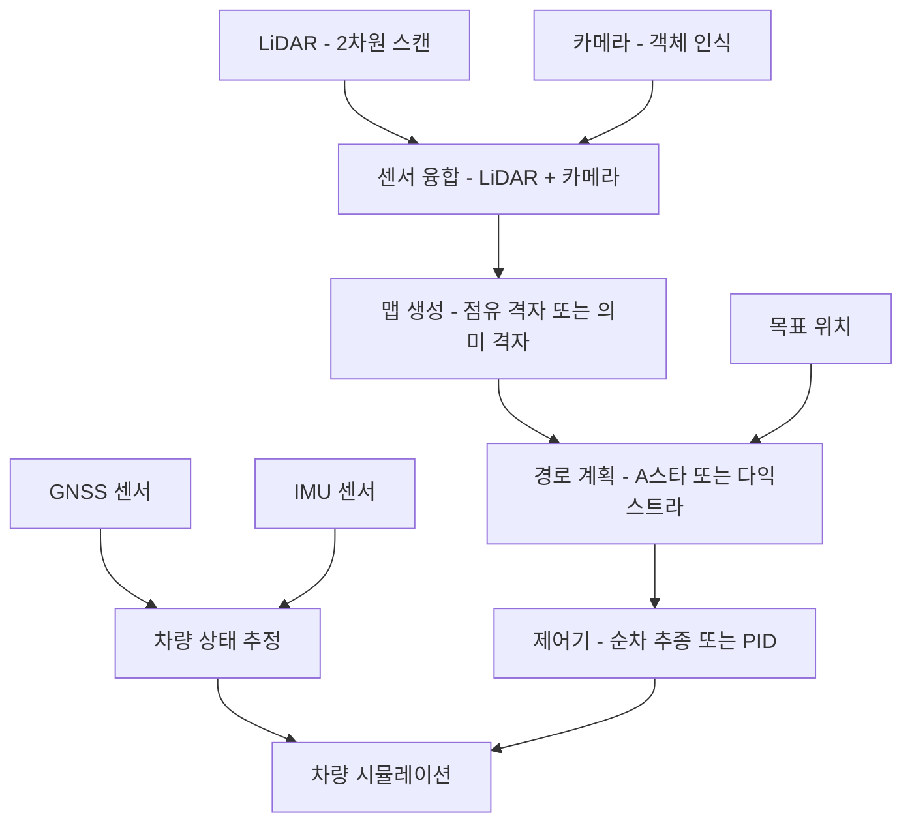
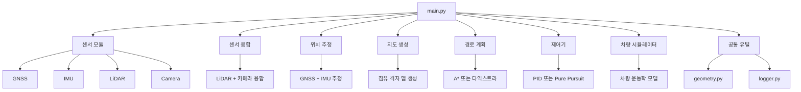

## 🚗 자율주행 시스템 전체 흐름도

```mermaid
graph TD
    %% 센서 입력
    GNSS[GNSS 센서]
    IMU[IMU 센서]
    LiDAR[LiDAR - 2D 라이다]
    Camera[카메라 - 객체 인식]

    %% 핵심 모듈
    Pose[차량 위치 추정 모듈]
    Fusion[센서 퓨전 - LiDAR + 카메라]
    MapBuilder[맵 생성 모듈 - 점유 격자 또는 의미 격자]
    PathPlanning[경로 계획 - A* 또는 다익스트라]
    Controller[제어기 - 퓨어 퍼슛 또는 PID]
    VehicleSim[차량 시뮬레이션 -Vehicle.py]

    %% 목표 위치
    Goal[목표 위치]

    %% 흐름 연결
    GNSS --> Pose
    IMU --> Pose
    Pose --> VehicleSim
    LiDAR --> Fusion
    Camera --> Fusion
    Fusion --> MapBuilder
    MapBuilder --> PathPlanning
    Goal --> PathPlanning
    PathPlanning --> Controller
    Controller --> VehicleSim
```

## 🚗 자율주행 시스템 구성도

```mermaid
graph TD
    %% 센서 입력
    GNSS[GNSS 센서]
    IMU[IMU 센서]
    LiDAR[LiDAR - 2차원 스캔]
    Camera[카메라 - 객체 인식]

    %% 상태 추정
    Pose[차량 상태 추정]

    %% 인식 및 맵 생성
    Fusion[센서 융합 - LiDAR + 카메라]
    MapBuilder[맵 생성 - 점유 격자 또는 의미 격자]

    %% 경로 계획 및 제어
    PathPlanning[경로 계획 - A스타 또는 다익스트라]
    Controller[제어기 - 순차 추종 또는 PID]

    %% 차량 모델
    VehicleSim[차량 시뮬레이션]

    %% 목표 지점
    Goal[목표 위치]

    %% 연결
    GNSS --> Pose
    IMU --> Pose
    Pose --> VehicleSim
    LiDAR --> Fusion
    Camera --> Fusion
    Fusion --> MapBuilder
    MapBuilder --> PathPlanning
    Goal --> PathPlanning
    PathPlanning --> Controller
    Controller --> VehicleSim
```

## 🧩 자율주행 시스템 Python 모듈 구조

```mermaid
graph TD

    A[main.py] --> B1[센서 모듈]
    A --> B2[센서 융합]
    A --> B3[위치 추정]
    A --> B4[지도 생성]
    A --> B5[경로 계획]
    A --> B6[제어기]
    A --> B7[차량 시뮬레이터]

    %% 센서 모듈 하위
    B1 --> C1[GNSS]
    B1 --> C2[IMU]
    B1 --> C3[LiDAR]
    B1 --> C4[Camera]

    %% 센서 융합
    B2 --> D1[LiDAR + 카메라 융합]

    %% 위치 추정
    B3 --> D2[GNSS + IMU 추정]

    %% 지도 생성
    B4 --> D3[점유 격자 맵 생성]

    %% 경로 계획
    B5 --> D4[A* 또는 다익스트라]

    %% 제어기
    B6 --> D5[PID 또는 Pure Pursuit]

    %% 차량 시뮬레이터
    B7 --> D6[차량 운동학 모델]

    %% 기타 유틸
    A --> B8[공통 유틸]
    B8 --> E1[geometry.py]
    B8 --> E2[logger.py]
```
